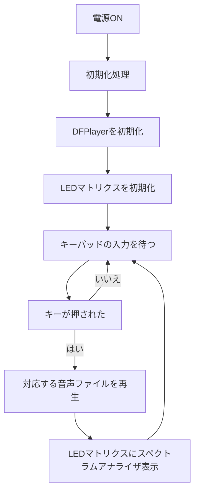

# 卒業制作2025
## 1. 概要
自作キーパッド + DFPlayer + RGB LEDマトリックスを使った自作MPC（Music Production Center）

### 主な機能
- キーパッド（4×4）で音声ファイルを選択・再生  
  - 各キーに対応した音声ファイルを再生可能

- DFPlayer MiniによるMP3再生  
  - microSDカードに保存された音声ファイルを再生

- WS2812B LEDマトリクス（8×32サイズ、配線図では8×8で代用）によるスペクトラムアナライザ表示  
  - 音声の強弱に応じてLEDがスペクトラムアナライザ表示される

## 2. 仕様書

### 配線図と回路図
※このプロジェクトではLEDマトリクス（8×32）を使用していますが、Fritzingの都合により配線図では 8×8 のマトリクスで代用しています

### 使用モジュールとピン
| 部品名                         | 個数 | 用途                             | 接続PIN                      |
|------------------------------|------|----------------------------------|----------------------------|
| Arduino UNO R4 WiFi          | 1個  | メインマイコン                   |                            |
| DFPlayer Mini                | 1個  | 音源ファイルの再生               |                            |
| microSDカード                 | 1枚  |  音源データ保存         |                            |
| スピーカー                    | 1個  | 音の出力                         |                            |
| 抵抗（1kΩ）                 | 2個  | 音声信号を安全に読み取れるように電圧を下げるため  |                            |
| LEDマトリクス（WS2812B 8×32） | 1個  | スペクトラムアナライザを表示                 |                            |
| キーパッド（4×4）            | 1個  | 押したキーに対応する音を鳴らすための入力装置                 |                            |

## 3. 動作仕様書
### フローチャート

## 参考
- [基本プロジェクト/RGB LED](https://docs.sunfounder.com/projects/elite-explorer-kit/ja/latest/basic_projects/11_basic_rgb_led.html)
- [基本プロジェクト/WS2812 RGB LEDストリップ](https://docs.sunfounder.com/projects/elite-explorer-kit/ja/latest/basic_projects/12_basic_ws2812.html#basic-ws2812)
- [基本プロジェクト/キーパッド](https://docs.sunfounder.com/projects/elite-explorer-kit/ja/latest/basic_projects/21_basic_keypad.html)
- [MP3 再生ユニットを作ってみる（Arduino使用）](https://diy-kousaku.com/p-10196/)
- [Arduino FFT Audio Spectrum analyzer on 8x32 color matrix WS2812B](https://projecthub.arduino.cc/mircemk/arduino-fft-audio-spectrum-analyzer-on-8x32-color-matrix-ws2812b-e07b35)
