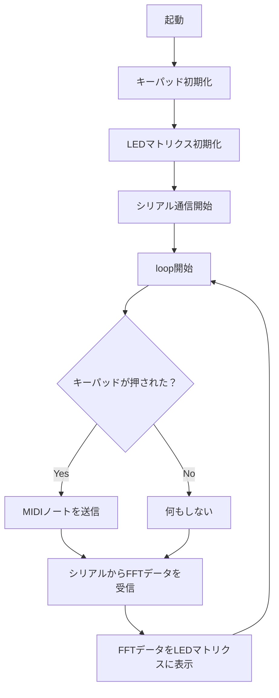

# 卒業制作2025
## 1. 概要 
自作キーパッド + DAW(Logic Pro) + RGB LEDマトリクスを使った自作MPC（Music Production Center）

### *主な機能*

- **キーパッドで音を鳴らす**  
  自作キーパッドを押すと、PCの音楽制作ソフト（Logic Pro）に信号を送り、ドラム音や効果音などのサンプルを再生する

- **Logic Proとの連携による音声再生**  
  ArduinoからのMIDI信号をLogic Proで受信し、ソフトウェア音源を鳴らす

- **FFT解析（PC側）**  
  Logic Proの音声出力をPCで取得し、リアルタイムFFT解析を実行する

- **WS2812B LEDマトリクスによるビジュアライザー表示**  
  PCで解析した音の強さや周波数に応じて、8×32のLEDマトリクスにスペクトラムアナライザを表示する

- **Arduino Uno R4 WiFiによる制御**  
  MIDI信号の送信、LED制御、キーパッド処理を1つのマイコンで実現する

## 2. 仕様書

### *配線図*
> ※この配線図はFritzingの都合により、以下の部品を代用品で表現しています
> - キーパッド：実際にはTM1637搭載の2線式キーパッド（CLK：D2 , DIO：D3）を使用
> - LEDマトリクス：実際には8×32のWS2812Bマトリクス（データピン：D6）を使用

### *回路図*

### *使用モジュールとピン*

| モジュール名              | 用途                                | 使用ピン（Arduino Uno R4 WiFi）     |
|---------------------------|-------------------------------------|--------------------------------------|
| TM1637キーパッドモジュール | キー入力                         | CLK: D2 / DIO: D3                   |
| WS2812B LEDマトリクス（8×32） | スペクトラムアナライザ表示           | データピン: D6                       |
| Arduino Uno R4 WiFi       | 全体制御（MIDI送信・LED制御・入力処理） | -                                    |
| PC（Logic Pro + FFT解析）            | 音声再生・FFT解析・LED表示データ送信      | USBシリアル通信                      |

### 使用ツール・環境

- **Arduino IDE**（統合開発環境 / マイコン用コードの開発・書き込み）
- **Processing**（ビジュアルプログラミング環境 / 音声解析とシリアル通信）
- **Logic Pro X**（DAW / 音声出力・ドラム音源の再生）
- **BlackHole**（仮想オーディオルーティング / ProcessingでLogic Proの音を取得）
- **Audio MIDI設定（IACドライバ）**（Mac標準 / 仮想MIDIポートの作成・接続）

### Arduino使用ライブラリ

- **Adafruit_NeoPixel**（LEDマトリクス制御用ライブラリ）
- **ErriezTM1637**（TM1637搭載キーパッドの読み取り用ライブラリ）

### Processing使用ライブラリ

- **processing.sound**（音声入力とFFT解析用）
- **processing.serial**（Arduinoとのシリアル通信）

## 3. フローチャート

## 参考

- [【Arduino】シリアルLED（WS2812B）を制御する](https://araisun.com/arduino-serial-led.html)
- [ArduinoでFFT解析し、ピークの周波数を検出する](https://qiita.com/ricelectric/items/98a6d32b1bcfca598762)
- [ErriezTM1637ライブラリ](https://github.com/Erriez/ErriezTM1637)
- [arduinoとprocessingの連携手順](https://note.com/nakariho/n/n92611b3c0046)
