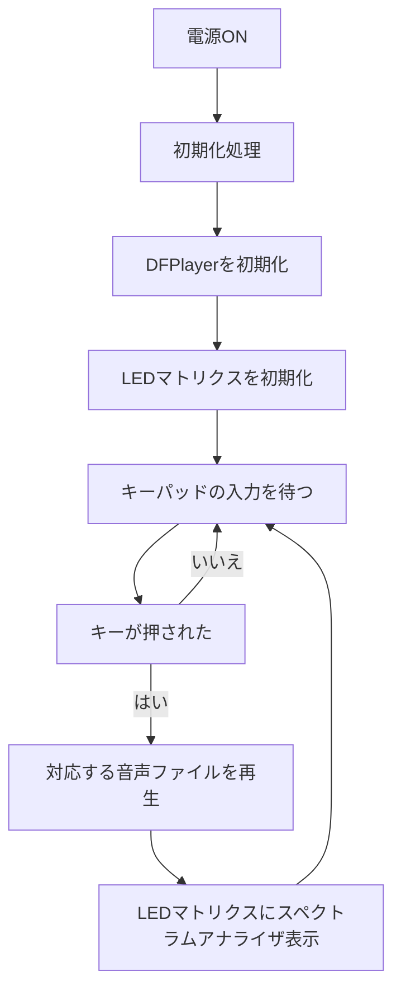

# 卒業制作2025
## 1. 概要
自作キーパッド + DFPlayer + RGB LEDマトリックスを使った自作MPC（Music Production Center）

### *主な機能*
- キーパッド（4×4）で音声ファイルを選択・再生  
  - 各キーに対応した音声ファイルを再生可能

- DFPlayer MiniによるMP3再生  
  - microSDカードに保存された音声ファイルを再生

- WS2812B LEDマトリクス（8×32サイズ、配線図では8×8で代用）によるスペクトラムアナライザ表示  
  - 音声の強弱に応じてLEDがスペクトラムアナライザ表示される

## 2. 仕様書

### *配線図と回路図*
※このプロジェクトではLEDマトリクス（8×32）を使用していますが、Fritzingの都合により配線図では 8×8 のマトリクスで代用しています

### *使用モジュールとピン*

| 部品名                          | 個数 | 用途                                                                 | 接続PIN                      |
|-------------------------------|------|----------------------------------------------------------------------|------------------------------|
| Arduino UNO R4 WiFi           | 1個  | メインマイコン                                                       | -                            |
| DFPlayer Mini                 | 1個  | 音源ファイルの再生                                                   | D10（TX）, D11（RX）         |
| microSDカード                 | 1枚  | 音源データ保存（DFPlayerに挿入）                                     | -                              |
| スピーカー                    | 1個  | 音の出力                                                             | DFPlayerのSPK_1, SPK_2       |
| LEDマトリクス（WS2812B 8×32） | 1個  | スペクトラムアナライザを表示                                         | D6（DIN）                    |
| キーパッド（4×4, TM1637）     | 1個  | 押したキーに対応する音を鳴らすための入力装置                         | D3（CLK）, D4（DIO）         |

## 3. フローチャート

## 参考
- [【Arduino】シリアルLED（WS2812B）を制御する](https://araisun.com/arduino-serial-led.html) 
- [ArduinoでAD入力値をFFTしてスペクトル分析＆表示をするチャレンジ](https://qiita.com/moppii/items/e5fb2407f4bae3e95c4a)
- [ErriezTM1637ライブラリ](https://github.com/Erriez/ErriezTM1637)
- [MP3 再生ユニットを作ってみる（Arduino使用）](https://diy-kousaku.com/p-10196/)

